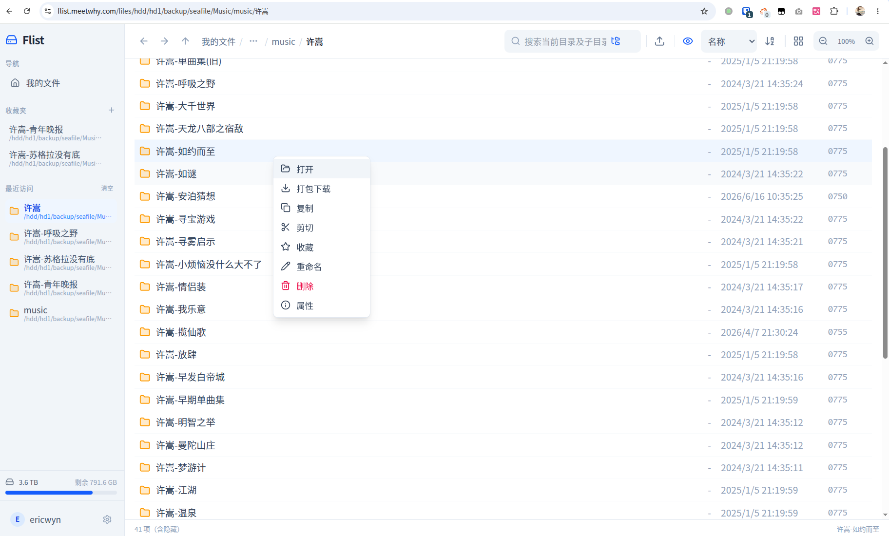
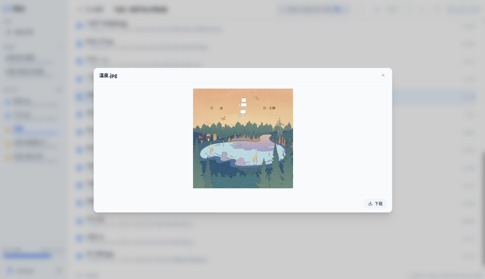
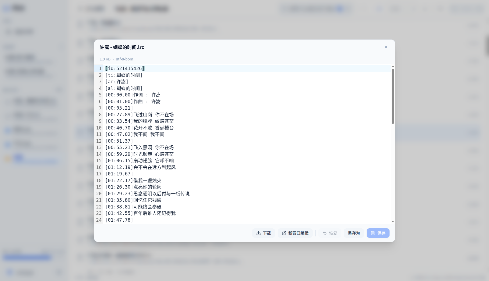
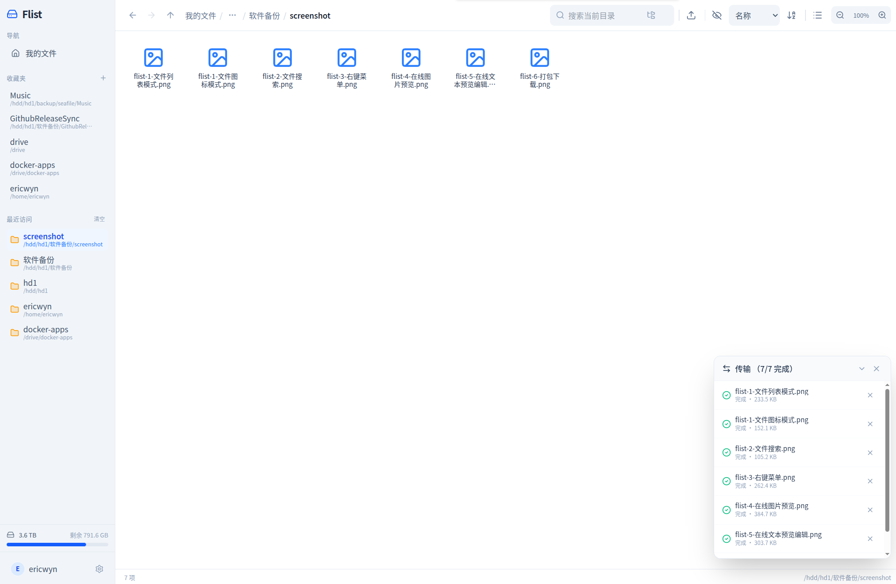
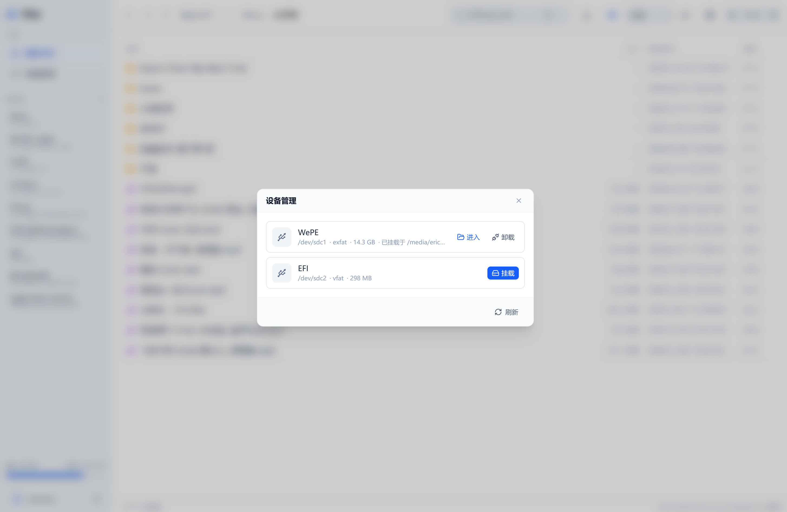

# flist

一个轻量的单二进制文件管理服务，专为 NAS、VPS 等场景设计。前端通过 `go:embed` 打包进 Go 二进制，零外部依赖部署即用。

> 适合需要远程管理服务器文件、搭建私人网盘、或在内网穿透场景下使用的用户。

## 界面预览

| 列表模式 | 图标模式 |
|:---:|:---:|
|  |  |

| 搜索 | 右键菜单 |
|:---:|:---:|
|  |  |

| 图片预览 | 文本编辑 |
|:---:|:---:|
|  |  |

| 打包下载 | 批量上传 |
|:---:|:---:|
|  |  |

| 设备管理 | 设备挂载 |
|:---:|:---:|
|  |  |

## UI 设计

- **响应式布局** — 左侧固定侧边栏（收藏夹 + 最近访问）+ 右侧文件浏览区，自适应屏幕尺寸
- **暗色模式** — 内置 Light / Dark 主题切换，跟随系统或手动设置
- **双视图模式** — 列表视图（详细信息）与网格视图（缩略图）自由切换，支持缩放
- **流畅动画** — 平滑的过渡效果、加载状态指示器、拖拽高亮反馈
- **右键菜单** — 完整的上下文菜单，支持文件操作、排序、视图切换等
- **面包屑导航** — 顶部路径栏支持点击跳转、右键菜单、拖拽上传
- **传输面板** — 右下角浮动面板，实时显示上传/下载进度、冲突处理
- **滚动位置记忆** — 返回上级目录时自动恢复之前的滚动位置

## 功能特性

- **单二进制交付** — 纯 Go 编写（含纯 Go SQLite 驱动），无 CGO 依赖，交叉编译开箱即用
- **文件浏览** — 目录列表、排序、分页、隐藏文件、符号链接处理
- **文件预览** — 文本 / 图片 / 视频 / 音频 / PDF，自动嗅探类型
- **在线编辑** — CodeMirror 6 语法高亮，乐观锁保存，冲突检测
- **文件操作** — 批量移动 / 复制 / 删除 / 重命名，支持自动避让
- **分片上传** — 断点续传（文件指纹），冲突处理（覆盖 / 改名 / 取消），实时进度
- **打包下载** — 多文件流式 zip，智能压缩
- **搜索** — 递归搜索，超时保护，结果上限
- **收藏夹** — 目录收藏、拖拽排序、有效性标记
- **最近访问** — 侧边栏快速回到最近浏览的文件或目录（可开关、可配置数量）
- **认证安全** — bcrypt 密码哈希、会话管理、安全响应头、IP 限流、路径越界防护、TOTP 两步验证（2FA）
- **移动设备管理** — 识别 U 盘 / 移动硬盘并一键挂载 / 卸载，挂载后作为独立命名空间浏览（基于 `lsblk` + `udisksctl`，仅 Linux）
- **跨平台** — Linux / Windows 双平台兼容，支持 Windows 长路径
- **存储驱动抽象** — 当前为本地驱动，预留 WebDAV / 网盘扩展点

## 快速开始

### 构建

```bash
# 完整生产构建（前端 + 后端）
make build

# 交叉编译
make build-linux     # → dist/flist-linux-amd64
make build-windows   # → dist/flist-windows-amd64.exe
```

> 构建前端需要 Node.js 与 npm。

### 运行

```bash
# 开发模式（使用仓库已提交的前端产物）
make run

# 生产运行
./flist --root /path/to/your/files
```

首次启动时自动创建管理员账户（`admin` + 随机密码），密码打印在启动日志中。登录后可在设置中修改。

### 重置管理员凭据

```bash
./flist --reset-admin
```

执行后会将 `id=1` 的管理员重置为 `admin` + 新随机密码，然后退出。

### 两步验证（2FA）

在设置界面中可以开启 TOTP 两步验证。开启后，登录需在密码验证通过后额外输入 6 位实时验证码（兼容 Google Authenticator、1Password 等验证器 App）。

如果丢失了验证设备，可以使用 `--reset-totp` 清除 TOTP 配置、恢复为纯密码登录：

```bash
./flist --reset-totp
```

执行后清除管理员（id=1）的 TOTP 配置并吊销所有已签发会话，然后退出。

## 快捷键

| 快捷键 | 功能 |
|--------|------|
| `Ctrl/Cmd + A` | 全选 |
| `Ctrl/Cmd + C` | 复制选中项 |
| `Ctrl/Cmd + X` | 剪切选中项 |
| `Ctrl/Cmd + V` | 粘贴 |
| `Ctrl/Cmd + S` | 保存（编辑器内） |
| `F2` | 重命名（单选时） |
| `Delete` / `Backspace` | 删除选中项 |
| `Escape` | 清空选择 / 关闭弹窗 |

## 配置

配置优先级：**命令行参数 > 环境变量 > 默认值**。

| 参数 | 环境变量 | 默认值 | 说明 |
|------|----------|--------|------|
| `--addr` | `FLIST_ADDR` | `:16550` | HTTP 监听地址 |
| `--root` | `FLIST_ROOT` | —（必填） | 管理的根目录 |
| `--data` | `FLIST_DATA` | `./data` | 数据目录（SQLite） |
| `--session-ttl` | `FLIST_SESSION_TTL` | `24h` | 会话有效期 |
| `--long-path` | `FLIST_LONG_PATH` | `false` | Windows 长路径支持 |
| `--cors-origin` | `FLIST_CORS_ORIGIN` | —（关闭） | CORS 来源（前后端分离调试） |
| `--max-upload` | `FLIST_MAX_UPLOAD` | `0`（不限） | 单文件上传上限（字节） |
| `--max-edit-size` | `FLIST_MAX_EDIT_SIZE` | `5242880`（5 MiB） | 在线编辑大小上限（字节） |
| `--debug` | `FLIST_DEBUG` | `false` | 调试日志 |
| `--reset-admin` | — | `false` | 重置管理员凭据后退出 |
| `--reset-totp` | — | `false` | 清除管理员 TOTP 配置后退出 |

## 开发

### 前端开发

```bash
cd frontend
npm install
npm run dev    # Vite dev server，代理 API 到 :16550
```

### 后端开发

```bash
make run       # go run ./cmd/flist --root ./testroot
make test      # go test ./...
make vet       # go vet ./...
```

### 技术栈

**后端**：Go 1.25 · [chi](https://github.com/go-chi/chi) · [modernc.org/sqlite](https://gitlab.com/cznic/sqlite)（纯 Go SQLite） · bcrypt · 令牌桶限流

**前端**：React 19 · TypeScript · Vite 6 · Tailwind CSS 4 · Zustand · CodeMirror 6 · lucide-react

## 项目结构

```
flist/
├── cmd/flist/          # 程序入口
├── internal/
│   ├── config/         # 配置加载
│   ├── handler/        # HTTP 请求处理器
│   ├── middleware/     # 中间件（认证/限流/安全/日志）
│   ├── model/          # 数据模型 / DTO
│   ├── server/         # 路由装配
│   ├── service/        # 业务编排层
│   ├── storage/        # 存储驱动抽象 + local 实现
│   ├── store/          # SQLite 数据访问
│   └── util/           # 跨平台工具
├── frontend/           # React SPA
├── web/                # 前端构建产物（go:embed）
├── docs/               # 设计文档
└── Makefile
```

## License

MIT
