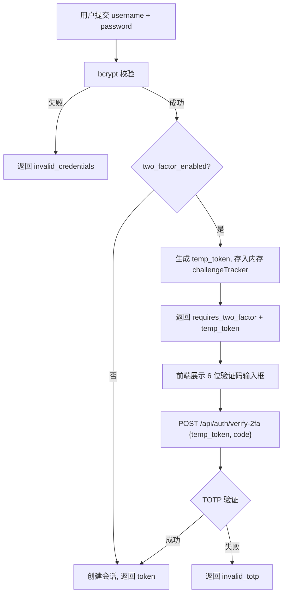

# 2FA 验证登录方案概述

## 背景

flist 是一个 NAS 远程文件浏览器，当前仅依靠用户名 + 密码进行登录认证。由于 flist 常部署在公网或家庭网络边缘，密码登录存在被暴力破解或凭据泄露的风险。为提高账户安全性，需要支持基于 TOTP（Time-Based One-Time Password）的两步验证（2FA），用户在密码验证通过后还需输入 6 位实时验证码才能完成登录。

## 当前现状

### 认证主链路

```text
前端 LoginPage
  -> POST /api/auth/login {username, password}
  -> handler.AuthHandler.Login
  -> service.AuthService.Login
    -> lockout 检查
    -> store.GetUserByUsername
    -> bcrypt.CompareHashAndPassword
    -> store.CreateSession (生成不透明令牌，SHA-256 哈希存储)
  -> 返回 {token, expires_at, username}
  -> 前端 setToken -> status: authenticated
```

### 关键文件与数据结构

| 层 | 文件 | 关键结构 |
| --- | --- | --- |
| Model | `internal/model/model.go` | `User{ID, Username, Password, CreatedAt, UpdatedAt}` |
| Store | `internal/store/user.go` | `GetUserByUsername`、`GetUserByID`、`scanUser` |
| Store | `internal/store/db.go` | `schema` 常量，`CREATE TABLE IF NOT EXISTS users`，无版本化迁移 |
| Service | `internal/service/auth.go` | `AuthService`、`Login()`、`LoginResult{Token, ExpiresAt, User}` |
| Handler | `internal/handler/auth.go` | `AuthHandler`、`loginRequest`、`loginResponse` |
| Handler | `internal/handler/errors.go` | 错误码常量（1001-1006, 2001-2016, 3001-3002, 4000, 9001-9002） |
| Routes | `internal/server/routes.go` | `NewRouter`，公开路由 `POST /api/auth/login` |
| Config | `internal/config/config.go` | pflag 解析，已有 `--reset-admin` 模式 |
| CLI | `cmd/flist/main.go` | `run()` 函数，`--reset-admin` 分支在 authSvc 创建后检查 |
| 前端 API | `frontend/src/lib/api.ts` | `api.login()`、`LoginData` |
| 前端 Store | `frontend/src/authStore.ts` | `useAuthStore`，`login()` 方法 |
| 前端页面 | `frontend/src/components/LoginPage.tsx` | 用户名 + 密码表单 |
| 前端设置 | `frontend/src/components/SettingsModal.tsx` | 账户/密码/外观/最近访问/退出 五个分区 |

### 当前问题点

1. 无任何 TOTP/2FA 能力，Go 端和前端均未引入相关依赖
2. `users` 表无 `totp_secret`、`two_factor_enabled` 字段
3. 登录流程为单步密码验证，无中间验证步骤

## 目标

1. 用户可在设置界面开启 2FA，开启时需扫描 QR 码并输入验证码确认
2. 开启 2FA 后，登录需两步：密码验证通过 → 输入 6 位 TOTP 验证码 → 获得会话令牌
3. 用户可在设置界面关闭 2FA，关闭时需输入当前验证码确认
4. 提供 `--reset-totp` CLI 参数，用于丢失验证设备时清除 TOTP 配置、恢复纯密码登录
5. TOTP secret 明文存储于 SQLite 数据库

## 非目标

1. 不做备份恢复码（backup codes）
2. 不做 TOTP secret 加密存储（明文存库）
3. 不做短信/邮件验证码等其他 2FA 方式
4. 不做"记住此设备 30 天"（trust device）功能
5. 不做多用户 2FA 管理界面（仅当前登录用户管理自己的 2FA）

## 核心设计

### 总体原则

采用标准 TOTP（RFC 6238）协议，与 Google Authenticator、1Password、Authy 等主流验证器 App 兼容。登录流程改造为两步：密码验证通过后若 2FA 已启用，返回一个短时效临时令牌（temp_token），前端据此展示验证码输入步骤，用户输入验证码后换取正式会话令牌。

### 登录流程



### 方案取舍

| 决策点 | 选择 | 理由 |
| --- | --- | --- |
| TOTP 库 | `github.com/pquerna/otp` | 社区标准库，API 简洁，支持 TOTP/HOTP |
| QR 码生成 | `github.com/skip2/go-qrcode` | 直接生成 PNG bytes，前端 `` 展示 |
| TOTP secret 存储 | 明文存 SQLite | 用户确认，简单优先 |
| 备份恢复码 | 不做 | 用户确认，通过 `--reset-totp` 兜底 |
| temp_token 存储 | 进程内存 map + TTL | 短时效（5 分钟），服务重启则重新登录，无需持久化 |
| 2FA 设置流程 | setup 生成 secret 存库但未启用 → enable 验证后启用 | 中途放弃无安全影响，secret 已在库中但 `two_factor_enabled=0` |
| disable 2FA 确认 | 需输入当前 TOTP 验证码 | 防止会话劫持后直接关闭 2FA |

## 数据结构 / 协议设计

### 数据库 Schema 变更

`users` 表新增两列：

```sql
totp_secret        TEXT     DEFAULT ''   -- TOTP 密钥（Base32），明文存储
two_factor_enabled INTEGER  DEFAULT 0    -- 0=未启用, 1=已启用
```

由于项目无版本化迁移系统（使用 `CREATE TABLE IF NOT EXISTS`），迁移策略为：

1. 在 `CREATE TABLE users` 语句中加入新列（新建库直接拥有）
2. 新增 `migrateAddColumns` 方法，通过 `PRAGMA table_info(users)` 检查已有列，对缺失列执行 `ALTER TABLE users ADD COLUMN`

### Model 层变更

```go
type User struct {
    ID                int64     `json:"id"`
    Username          string    `json:"username"`
    Password          string    `json:"-"`
    TOTPSecret        string    `json:"-"`              // 明文存储，永不序列化返回
    TwoFactorEnabled  bool      `json:"two_factor_enabled"`
    CreatedAt         time.Time `json:"created_at"`
    UpdatedAt         time.Time `json:"updated_at"`
}
```

### API 协议

#### 登录（改造）

`POST /api/auth/login`

请求（不变）：

```json
{ "username": "admin", "password": "xxx" }
```

响应 A（2FA 未启用，不变）：

```json
{
  "code": 0,
  "message": "success",
  "data": { "token": "xxx", "expires_at": 1719360000, "username": "admin" }
}
```

响应 B（2FA 已启用，新增）：

```json
{
  "code": 0,
  "message": "success",
  "data": { "requires_two_factor": true, "temp_token": "yyy" }
}
```

#### 2FA 验证登录（新增）

`POST /api/auth/verify-2fa`

```json
// 请求
{ "temp_token": "yyy", "code": "123456" }

// 成功响应
{ "code": 0, "message": "success", "data": { "token": "xxx", "expires_at": 1719360000, "username": "admin" } }

// 失败响应
{ "code": 1008, "message": "invalid_totp", "data": null }
```

#### 2FA 状态查询（新增）

`GET /api/2fa/status`

```json
{ "code": 0, "message": "success", "data": { "enabled": false } }
```

#### 2FA 设置初始化（新增）

`POST /api/2fa/setup`

```json
// 成功响应
{ "code": 0, "message": "success", "data": { "secret": "JBSWY3DPEHPK3PXP", "qr_code": "data:image/png;base64,iVBOR..." } }
```

#### 2FA 启用确认（新增）

`POST /api/2fa/enable`

```json
// 请求
{ "code": "123456" }

// 成功响应
{ "code": 0, "message": "success", "data": null }
```

#### 2FA 关闭（新增）

`POST /api/2fa/disable`

```json
// 请求
{ "code": "123456" }

// 成功响应
{ "code": 0, "message": "success", "data": null }
```

### 新增错误码

| 常量 | 值 | 含义 |
| --- | --- | --- |
| `CodeTwoFactorRequired` | 1007 | 需要 2FA 验证 |
| `CodeInvalidTOTP` | 1008 | TOTP 验证码错误或 temp_token 无效 |
| `CodeTOTPAlreadyEnabled` | 1009 | 2FA 已启用，不能重复开启 |
| `CodeTOTPNotEnabled` | 1010 | 2FA 未启用，无需关闭 |

### CLI 参数

```
--reset-totp   清除管理员（id=1）的 TOTP 配置，恢复为纯密码登录后退出，不启动服务。
```

## 实现方案

### 1. 依赖

`go.mod` 新增：

- `github.com/pquerna/otp` — TOTP 密钥生成与验证
- `github.com/skip2/go-qrcode` — QR 码 PNG 生成

### 2. 数据库层（`internal/store/db.go`）

- `schema` 常量的 `CREATE TABLE users` 语句新增 `totp_secret TEXT DEFAULT ''` 和 `two_factor_enabled INTEGER DEFAULT 0`
- 新增 `migrateAddColumns()` 方法：
  - 查询 `PRAGMA table_info(users)`
  - 检查 `totp_secret` 和 `two_factor_enabled` 是否存在
  - 对缺失列执行 `ALTER TABLE users ADD COLUMN ...`
- `migrate()` 方法末尾调用 `migrateAddColumns()`

### 3. Model 层（`internal/model/model.go`）

- `User` 结构体新增 `TOTPSecret string` 和 `TwoFactorEnabled bool` 字段

### 4. Store 层（`internal/store/user.go`）

- `scanUser` 的 `SELECT` 查询和 `Scan` 调用新增 `totp_secret`、`two_factor_enabled`
- `GetUserByUsername`、`GetUserByID` 的 SQL 语句新增两列
- 新增 `UpdateTOTP(userID int64, secret string, enabled bool) error` 方法

### 5. Service 层

#### 新建 `internal/service/twofactor.go`

```go
// twoFactorChallenge 是密码验证通过后的临时凭证，仅用于 2FA 验证步骤。
type twoFactorChallenge struct {
    userID    int64
    expiresAt time.Time
}

// challengeTracker 管理内存中的 2FA 挑战令牌。
type challengeTracker struct {
    mu        sync.Mutex
    challenges map[string]*twoFactorChallenge
}
```

核心函数（挂在 AuthService 上或独立的 TwoFactorService 上）：

- `generateTOTPSecret(username string) (secret string, key *otp.Key, err error)` — 调用 `totp.Generate(totp.GenerateOpts{Issuer: "flist", AccountName: username})`
- `generateQRCode(otpURL string) (base64 string, err error)` — 用 `go-qrcode` 生成 PNG，base64 编码
- `validateTOTP(code, secret string) bool` — 调用 `totp.Validate(code, secret)`

#### 修改 `internal/service/auth.go`

- `LoginResult` 新增字段：

```go
type LoginResult struct {
    Token             string
    ExpiresAt         time.Time
    User              *model.User
    RequiresTwoFactor bool     // 为 true 时 Token/ExpiresAt/User 为空
    TempToken         string   // 仅 RequiresTwoFactor=true 时有值
}
```

- `AuthService` 新增 `challenge *challengeTracker` 字段，在 `NewAuthService` 中初始化
- `Login` 方法：bcrypt 校验成功后检查 `user.TwoFactorEnabled`，若为 true 则生成 temp_token、存入 challengeTracker（5 分钟过期）、返回 `RequiresTwoFactor=true`
- 新增方法：
  - `VerifyTwoFactor(tempToken, code string) (*LoginResult, error)` — 校验 temp_token 有效且未过期，校验 TOTP code，通过后创建正式会话
  - `SetupTwoFactor(userID int64) (secret, qrBase64 string, err error)` — 生成 secret 存入 DB（`two_factor_enabled` 保持 0），返回 secret + QR 码
  - `EnableTwoFactor(userID int64, code string) error` — 读取已存储的 secret，验证 code，通过后设 `two_factor_enabled=1`
  - `DisableTwoFactor(userID int64, code string) error` — 验证 code，通过后清空 secret + 设 `two_factor_enabled=0`
  - `GetTwoFactorStatus(userID int64) (bool, error)` — 返回 `two_factor_enabled` 状态
  - `ResetTOTP(userID int64) error` — 清空 secret + 设 `two_factor_enabled=0` + 删除该用户所有会话

### 6. Handler 层

#### 新建 `internal/handler/twofactor.go`

- `TwoFactorHandler` 结构体，持有 `*service.AuthService`
- `Setup(w, r)` — 从上下文取 userID，调用 `SetupTwoFactor`，返回 `{secret, qr_code}`
- `Enable(w, r)` — 解析 `{code}`，调用 `EnableTwoFactor`
- `Disable(w, r)` — 解析 `{code}`，调用 `DisableTwoFactor`
- `Status(w, r)` — 调用 `GetTwoFactorStatus`，返回 `{enabled}`

#### 修改 `internal/handler/auth.go`

- `loginResponse` 新增 `RequiresTwoFactor bool` 和 `TempToken string`（均 `omitempty`）
- `Login` handler：当 `res.RequiresTwoFactor` 为 true 时，不设置 Cookie，返回 `requires_two_factor + temp_token`
- 新增 `VerifyTwoFactor(w, r)` handler — 解析 `{temp_token, code}`，调用 `VerifyTwoFactor`，成功后设置 Cookie 并返回正式 token

#### 修改 `internal/handler/errors.go`

- 新增 `CodeTwoFactorRequired = 1007`
- 新增 `CodeInvalidTOTP = 1008`
- 新增 `CodeTOTPAlreadyEnabled = 1009`
- 新增 `CodeTOTPNotEnabled = 1010`

### 7. 路由注册（`internal/server/routes.go`）

公开路由新增：

```go
api.Post("/auth/verify-2fa", authHandler.VerifyTwoFactor)
```

受保护路由新增：

```go
protected.Get("/2fa/status", twofactorHandler.Status)
protected.Post("/2fa/setup", twofactorHandler.Setup)
protected.Post("/2fa/enable", twofactorHandler.Enable)
protected.Post("/2fa/disable", twofactorHandler.Disable)
```

`Deps` 新增 `TwoFactor` 字段（或直接由 `Auth` 服务提供方法，handler 直接调用 `Auth`）。

### 8. CLI `--reset-totp`

#### `internal/config/config.go`

- `Config` 新增 `ResetTOTP bool`
- 新增 pflag：`resetTotp := fs.Bool("reset-totp", false, "清除管理员（id=1）的 TOTP 配置，恢复为纯密码登录后退出，不启动服务。")`
- `--reset-totp` 模式与 `--reset-admin` 一样不需要 `--root`

#### `cmd/flist/main.go`

在 `--reset-admin` 分支之后新增：

```go
if cfg.ResetTOTP {
    if err := authSvc.ResetTOTP(1); err != nil {
        return fmt.Errorf("reset totp failed: %w", err)
    }
    logger.Info("totp config reset; login with password")
    return nil
}
```

### 9. 前端 API 层（`frontend/src/lib/api.ts`）

- `LoginData` 新增可选字段：

```typescript
requires_two_factor?: boolean;
temp_token?: string;
```

- 新增方法：

```typescript
verifyTwoFactor(tempToken: string, code: string): Promise<LoginData>
setupTwoFactor(): Promise<{ secret: string; qr_code: string }>
enableTwoFactor(code: string): Promise<null>
disableTwoFactor(code: string): Promise<null>
getTwoFactorStatus(): Promise<{ enabled: boolean }>
```

### 10. 前端 Auth Store（`frontend/src/authStore.ts`）

- State 新增：

```typescript
twoFactorRequired: boolean;
tempToken: string | null;
```

- `login()`：若返回 `requires_two_factor`，设 `twoFactorRequired=true` + `tempToken`，不设 token
- 新增 `verifyTwoFactor(code: string)`：调用 verify API，成功后设 token + `status: authenticated`，清除 2FA 临时状态
- `clearError()` 同时重置 2FA 状态

### 11. 前端登录页（`frontend/src/components/LoginPage.tsx`）

- 从 authStore 读取 `twoFactorRequired`
- 若为 true：隐藏用户名/密码表单，展示 6 位验证码输入框（`inputMode="numeric"`、`maxLength={6}`）+ 提交按钮
- 提交时调用 `verifyTwoFactor(code)`
- 提供"返回"按钮回到用户名/密码输入步骤

### 12. 前端设置弹窗（`frontend/src/components/SettingsModal.tsx`）

在「修改密码」与「外观」之间新增「安全」分区：

- `TwoFactorSection` 组件，使用 `Shield` 图标
- 初始化时调用 `api.getTwoFactorStatus()` 获取当前状态
- **未启用状态**：显示「开启 2FA」按钮 → 点击调用 `setupTwoFactor()` → 展示 QR 码图片 + secret 字符串 + 验证码输入框 → 用户扫码输入验证码 → 调用 `enableTwoFactor(code)`
- **已启用状态**：显示「已开启」标识 + 「关闭 2FA」按钮 → 点击展示验证码输入框 → 调用 `disableTwoFactor(code)`

## 兼容与降级

| 场景 | 处理方式 |
| --- | --- |
| 已有数据库无新列 | `migrateAddColumns` 通过 `PRAGMA table_info` 检测并 `ALTER TABLE` 补列 |
| 已登录的旧会话 | 不受影响，`two_factor_enabled` 默认为 0，旧会话继续有效 |
| 服务重启时 2FA 挑战进行中 | temp_token 存于内存，重启后丢失，用户需重新登录（可接受） |
| 用户丢失验证设备 | 使用 `--reset-totp` CLI 参数清除 TOTP 配置 |
| QR 码加载失败 | 同时返回 secret 字符串，用户可手动输入到验证器 |
| `--reset-totp` 对未启用 2FA 的用户 | 无副作用，secret 为空、enabled 为 0，操作幂等 |

## 可观测性

1. 关键日志：
   - 2FA 开启成功：`logger.Info("2fa enabled", slog.Int64("user_id", userID))`
   - 2FA 关闭成功：`logger.Info("2fa disabled", slog.Int64("user_id", userID))`
   - 2FA 验证失败：`logger.Warn("2fa verify failed", slog.Int64("user_id", userID), slog.String("reason", "invalid_code"))`
   - TOTP 重置：`logger.Info("totp reset", slog.Int64("user_id", userID))`
2. 不记录 secret、不记录验证码明文

## 测试计划

### 单元测试

1. `twofactor.go`：
   - TOTP secret 生成 → 验证码验证（使用 `totp.GenerateCode` 生成当前码）
   - 过期 temp_token 验证返回错误
   - 错误验证码返回 `ErrInvalidTOTP`
2. `auth.go`：
   - 2FA 未启用时 `Login` 返回正常 token
   - 2FA 启用时 `Login` 返回 `RequiresTwoFactor=true`
   - `VerifyTwoFactor` 成功后返回正式 token
   - `SetupTwoFactor` → `EnableTwoFactor` → `DisableTwoFactor` 全流程

### 手动验证

1. 启动 flist → 登录 → 设置中开启 2FA → 扫码 → 输入验证码 → 确认启用
2. 退出登录 → 重新登录 → 输入密码 → 出现验证码输入 → 输入验证码 → 登录成功
3. 输入错误验证码 → 提示错误 → 可重新输入
4. 设置中关闭 2FA → 输入验证码 → 确认关闭
5. 开启 2FA 后使用 `--reset-totp` → 重启 → 登录无需验证码

## 上线与回滚

### 上线步骤

1. 新增依赖 `go mod tidy`
2. 后端代码改动（store → model → service → handler → routes → config → main）
3. 前端代码改动（api → authStore → LoginPage → SettingsModal）
4. 数据库迁移自动执行（`migrateAddColumns`）
5. 编译部署

### 回滚

1. 回滚代码到上一版本
2. 数据库新增的列不影响旧代码（旧代码不查询这些列，SQLite 不会因多余列报错）
3. `two_factor_enabled` 为 0 的用户行为与回滚前一致
4. 若需彻底清理：手动执行 `ALTER TABLE users DROP COLUMN totp_secret`（SQLite 3.35+ 支持）

## 建议实施顺序

1. 后端：依赖 → DB schema → model → store → service → handler → routes → config → main
2. 前端：api → authStore → LoginPage → SettingsModal
3. 测试：单元测试 → 手动验证

## 风险与待确认问题

### 已确认决策

1. TOTP secret 明文存储于数据库 — 用户确认
2. 不做备份恢复码 — 用户确认，通过 `--reset-totp` 兜底
3. TOTP 库使用 `pquerna/otp` — 用户确认

### 风险

1. **temp_token 内存存储不跨重启**：可接受，重启后用户重新登录即可
2. **TOTP secret 明文泄露风险**：数据库被直接读取时 secret 暴露，但 flist 为单用户场景且数据库在 dataDir 下，风险可控
3. **验证码暴力破解**：当前登录有 lockout 机制（5 次失败锁定 15 分钟），verify-2fa 同样复用该机制或独立计数
